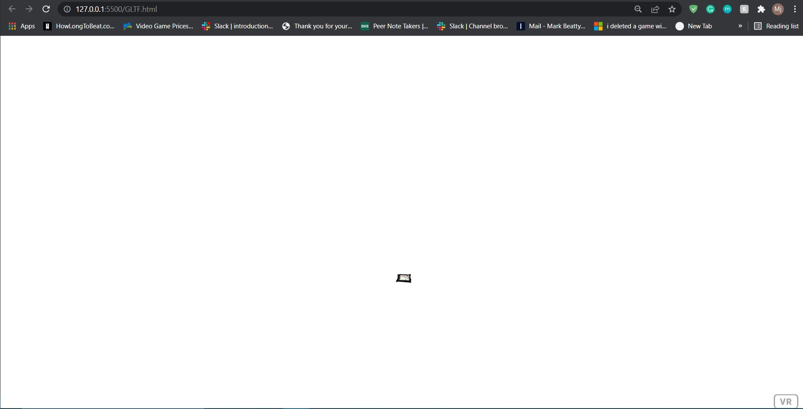

# Create a 3-D model using photogrammetry techniques
 
**Present project shows 3-D model using photogrammetry I took pictures of my laptop. The quality isnt good**

### **Description**
I created a 3D model using photogrammetry techniques.
- GTLF.html (main project file) 
- readme.md (markdown file)
- Pic.glb (3D model)
- img folder with screenshot.jpg

### **Project Screenshots**
Screenshot of the project.

### **Author**
The author of the project: MJ Beatty
